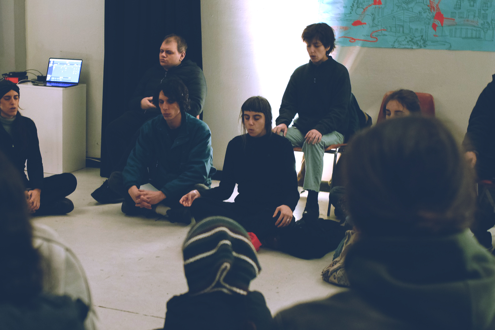

import ProjectInfo from "../../../../components/ProjectInfo.astro";
import zhi from "./zhi.jpeg";

<ProjectInfo
  collaborators={[
    {
      name: "Zhi Keng He",
      url: "https://github.com/zhik",
      img: zhi,
    },
  ]}
  timeline={{
    start: "July 2022",
    end: "August 2022",
  }}
  tech={["Mapbox", "Svelte", "Tailwind"]}
  roles={["Research", "Product Design", "Engineering"]}
  repo="betanyc/nyc-boundaries"
  website="https://boundaries.beta.nyc"
/>

## Pratiche di canto armonico collettive

Per “canto armonico” si intende un insieme di tecniche vocali che rendono chiaramente percepibili gli armonici di un suono fondamentale. Dopo anni di pratica con il compositore Roberto Laneri, con cui collabora stabilmente, inizia recentemente a dedicarsi alla sua trasmissione attraverso momenti di condivisione vocale collettiva. A partire dalla sintesi delle tecniche vocali e compositive teorizzata dallo stesso Roberto Laneri, contaminata dalla propria ricerca ed esperienza artistica, sta elaborando una modalità di trasmissione personale che vede il canto armonico come pratica di ascolto attivo e di espressione vocale.

Dal 2023 il cuore degli incontri si svolge presso via Zamboni 72 a Bologna. Sono stati ospiti di: INOSSERVANZA Festival (Bologna 2023), fermento \\\ ambienti memorie ascolti (Roma 2023), OFF GALLLERIAPIÙ (Bologna 2024), SASA – Summer Academy of Sonic Arts (Corfù 2023).

<figure>
  
  <figcaption>
    **Pratiche di canto armonico a CIRCA STUDIO.** Foto di Maria Giovanna Sodero, CIRCA STUDIO.
  </figcaption>
</figure>

## Calendario

- 1, 8, 22 ottobre
- 5, 12, 26 novembre 
- 10 dicembre

Ore 19:30-21
